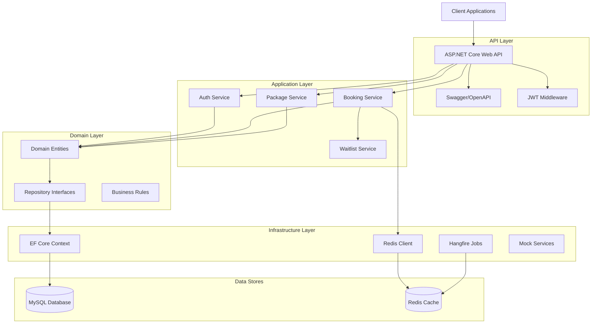

# Booking System Architecture

## System Architecture

## Clean Architecture Layers

### 1. Domain Layer (Core)
- **Entities**: User, Package, ClassSchedule, Booking, WaitlistEntry
- **Interfaces**: Repository interfaces, service interfaces
- **Exceptions**: Custom business exceptions
- **Enums**: BookingStatus, UserRole

### 2. Application Layer (Use Cases)
- **Services**: Business logic implementation
- **DTOs**: Data transfer objects for API
- **Validators**: FluentValidation rules
- **Mappings**: AutoMapper profiles

### 3. Infrastructure Layer (External Concerns)
- **Data**: EF Core DbContext, configurations, migrations
- **Repositories**: Data access implementation
- **Services**: Redis, Email, Payment mock services
- **Jobs**: Hangfire background jobs

### 4. API Layer (Presentation)
- **Controllers**: HTTP endpoints
- **Middleware**: Exception handling, logging
- **Filters**: Validation, authorization

## Technology Stack

- **.NET 8.0** - Runtime & SDK
- **ASP.NET Core** - Web API framework
- **Entity Framework Core** - ORM
- **MySQL 8.0** - Relational database
- **Redis** - Caching & concurrency
- **Hangfire** - Background jobs
- **JWT** - Authentication
- **Swagger/OpenAPI** - API documentation
- **Docker** - Containerization

## Key Design Decisions

### Concurrency Control
- **Strategy**: Redis-first with database fallback
- **Implementation**: Atomic operations using Lua scripts
- **Fallback**: EF Core optimistic concurrency (RowVersion)

### Authentication
- **Method**: JWT Bearer tokens
- **Storage**: In-memory (stateless)
- **Refresh**: Refresh token pattern

### Caching Strategy
- **Slot availability**: Redis atomic counters
- **Waitlist**: Redis sorted sets (FIFO)
- **User sessions**: JWT (stateless)

### Background Jobs
- **Scheduler**: Hangfire
- **Storage**: Redis
- **Jobs**: 
  - Post-class cleanup (waitlist refunds)
  - Daily package expiration

## Deployment Architecture
[Client] → [Load Balancer] → [API Container(s)]
↓
[MySQL (PlanetScale)]
↓
[Redis (Upstash)]

## Data Flow

### Booking Flow
1. User requests booking via API
2. API validates JWT token
3. BookingService checks credits & slot availability
4. Redis atomic decrement for slot reservation
5. EF Core transaction for booking record
6. Waitlist promotion if cancellation occurs

### Concurrency Protection
1. Multiple requests hit booking endpoint
2. Redis Lua script ensures atomic slot checks
3. Only N requests succeed (where N = available slots)
4. Remaining requests join waitlist
5. No overbooking possible