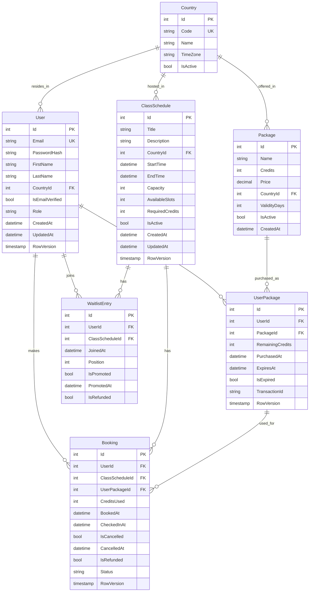

# Database Schema

## Entity Relationship Diagram

## Table Descriptions

### Users Table
Stores user accounts with authentication credentials and profile information.

**Key Indexes:**
- `idx_email` on Email (for login lookups)
- `idx_country` on CountryId (for regional queries)

### Countries Table
Reference data for supported countries/regions.

### Packages Table
Credit packages available for purchase in each country.

**Key Indexes:**
- `idx_country_active` on (CountryId, IsActive)

### UserPackages Table
User's purchased packages with remaining credits and expiry tracking.

**Key Indexes:**
- `idx_user_active` on (UserId, IsExpired, ExpiresAt)
- `idx_expiry` on (ExpiresAt, IsExpired) for cleanup jobs

### ClassSchedules Table
Available class sessions with capacity and timing.

**Key Indexes:**
- `idx_country_time` on (CountryId, StartTime, IsActive)
- `idx_start_time` on StartTime (for scheduling queries)

### Bookings Table
Confirmed bookings linking users to class schedules.

**Key Indexes:**
- `idx_user_class` on (UserId, ClassScheduleId)
- `idx_class_status` on (ClassScheduleId, Status)

### WaitlistEntries Table
Users waiting for slots in full classes (FIFO queue).

**Key Indexes:**
- `unique_user_class` on (UserId, ClassScheduleId)
- `idx_class_position` on (ClassScheduleId, Position, IsPromoted)

## Concurrency Control

### RowVersion (Timestamp)
Used for optimistic concurrency in:
- UserPackages (credit updates)
- ClassSchedules (slot updates)
- Bookings (status changes)

### Redis Keys
- `class:{id}:slots` - Available slot counter
- `class:{id}:waitlist` - Sorted set for FIFO waitlist